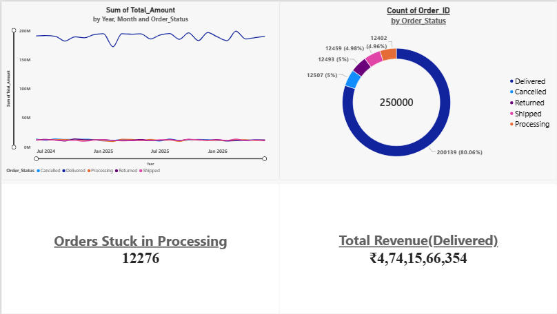
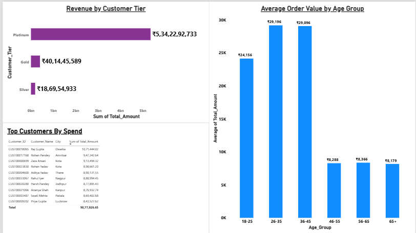
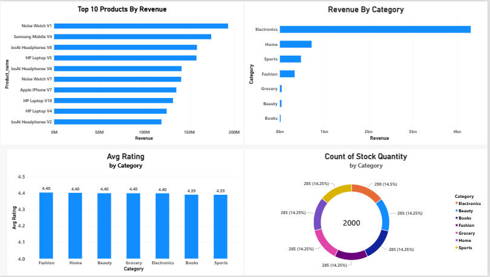
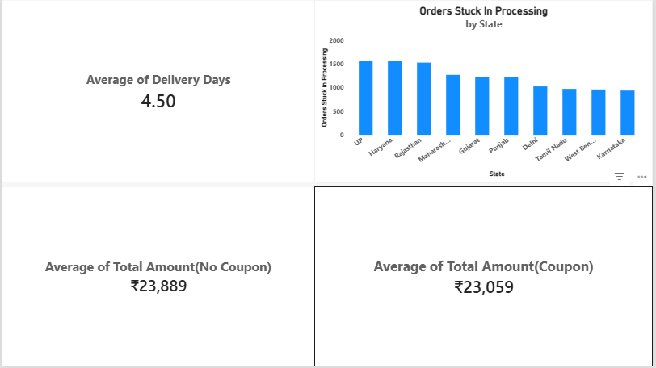
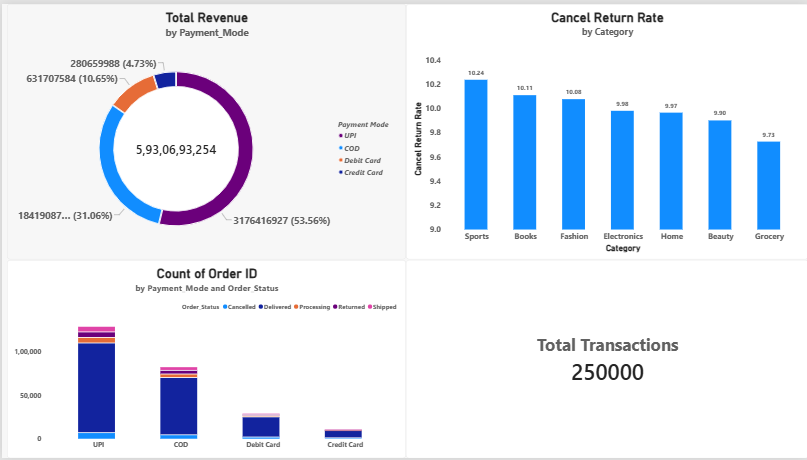
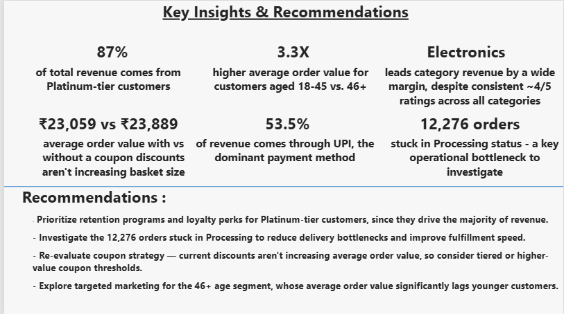

# Indian E-Commerce Sales & Revenue Leakage Analysis

I analyzed two years of transaction data (June 2024 – June 2026) from an Indian e-commerce platform spanning 40,000 customers, 2,000 products across 7 categories, and 250,000 orders. Nearly 20% of orders are Cancelled, Returned, or stuck in Processing — a direct hit to revenue and operational efficiency. My goal was to identify which customer segments, product categories, and payment methods drive the most reliable revenue, uncover the root causes behind order cancellations/returns, and evaluate whether coupon usage and pricing strategy are actually improving conversion or eroding margin.

## Dataset

- **Source:** [Indian E-Commerce Sales Analytics Dataset](https://www.kaggle.com/) (Kaggle)
- **Scale:** 40,000 customers · 2,000 products · 250,000 orders
- **Date range:** June 2024 – June 2026
- **Structure:** 3 relational tables (`customers`, `products`, `sales`) joined on `Customer_ID` and `Product_ID`

## Tech Stack

- **Python** — pandas for data quality checks and EDA, SQLAlchemy + PyMySQL for loading data into MySQL
- **MySQL** — relational schema, 11 SQL queries covering filtering, aggregation, window functions, and multi-step CTEs
- **Power BI** — 6-page interactive dashboard (Overview, Customer, Products, Orders, Payments, Key Insights)

## Key Findings

- **Cancellation/return rate is nearly uniform across every category (9.7%–10.2%).** This rules out category or product quality as the driver — the root cause is operational or behavioral, not product-specific.
- **High-return products maintain strong ratings (4.3–4.6 average)**, so poor product quality does not explain returns either.
- **99% of orders currently in "Processing" status (12,276 of 12,402) have been sitting there longer than a typical delivery window.** This is a real operational bottleneck, not a data artifact — some orders have been stuck since the very start of the dataset.
- **Platinum-tier customers drive roughly 87% of total revenue** despite being a small share of the customer base — a clear signal to prioritize retention for this segment.
- **Customers aged 26–45 spend close to 3x more per order (~₹29K) than customers aged 46+ (~₹8K)** — a strong age-based behavioral pattern.
- **Coupon usage does not increase average order value.** Orders placed without a coupon actually show a slightly *higher* average value (₹23,889) than orders placed with one (₹23,059), suggesting current discounts attract smaller, discount-driven purchases rather than lifting basket size.
- **UPI is the dominant payment method**, accounting for 53.5% of total revenue.
- **`Delivery_Date` in this dataset represents an expected delivery date, not an actual one** — the average gap between order and delivery date is ~4.5 days across every order status, including Cancelled and Processing orders, which would be impossible for an actual delivery timestamp. I documented this as an assumption rather than treating it as a data error.

## Recommendations

- Prioritize retention programs and loyalty perks for Platinum-tier customers, since they drive the majority of revenue.
- Investigate the 12,276 orders stuck in Processing to reduce fulfillment bottlenecks.
- Re-evaluate coupon strategy — current discounts aren't increasing average order value, so I'd consider tiered or higher-value coupon thresholds.
- Explore targeted marketing for the 46+ age segment, whose average order value significantly lags younger customers.

## Dashboard

**Overview** — revenue trend by month split by order status, order status breakdown, orders stuck in Processing, total delivered revenue


**Customer** — revenue by customer tier, average order value by age group, top customers by spend


**Products** — top 10 products by revenue, revenue by category, average rating by category


**Orders** — average delivery days, coupon usage impact on order value


**Payments** — revenue by payment mode, order status by payment mode, cancellation/return rate by category


**Key Insights** — summary of findings and recommendations


## Repository Structure

```
├── data/raw/                  # Raw CSVs (customers, products, sales)
├── notebooks/
│   └── 01_data_quality_check.ipynb
├── sql/
│   ├── schema.sql
│   ├── 01_basic_queries.sql
│   ├── 02_agg_queries.sql
│   ├── 03_Ranking_Window.sql
│   ├── 04_Time_Analysis.sql
│   └── 05_CTEs_Multistep.sql
├── python/
│   └── load_to_mysql.py       # Loads cleaned CSVs into MySQL via SQLAlchemy
├── powerbi/
│   ├── ecommerce_analytics.pbix
│   └── screenshots/
├── docs/
│   ├── business_problem.md
│   └── data_dictionary.md
└── requirements.txt
```

## How I Reproduced This

1. Ran `notebooks/01_data_quality_check.ipynb` to validate the raw data (nulls, duplicate keys, orphaned foreign keys, date logic).
2. Ran `sql/schema.sql` in MySQL Workbench to create the database and tables.
3. Ran `python/load_to_mysql.py` to load the cleaned CSVs into MySQL.
4. Worked through the 11 SQL queries in `sql/` against the loaded database.
5. Connected Power BI Desktop directly to MySQL and built the 6-page dashboard.

## Skills Demonstrated

- **SQL:** joins, CTEs, window functions (`RANK()`, `ROW_NUMBER()`, `LAG()`), conditional aggregation
- **Python:** pandas for data validation and EDA, SQLAlchemy for database loading
- **Power BI:** multi-page dashboard design, DAX measures, relationship modeling
- **Data storytelling:** translating a business problem into specific, testable questions and turning query results into actionable recommendations
